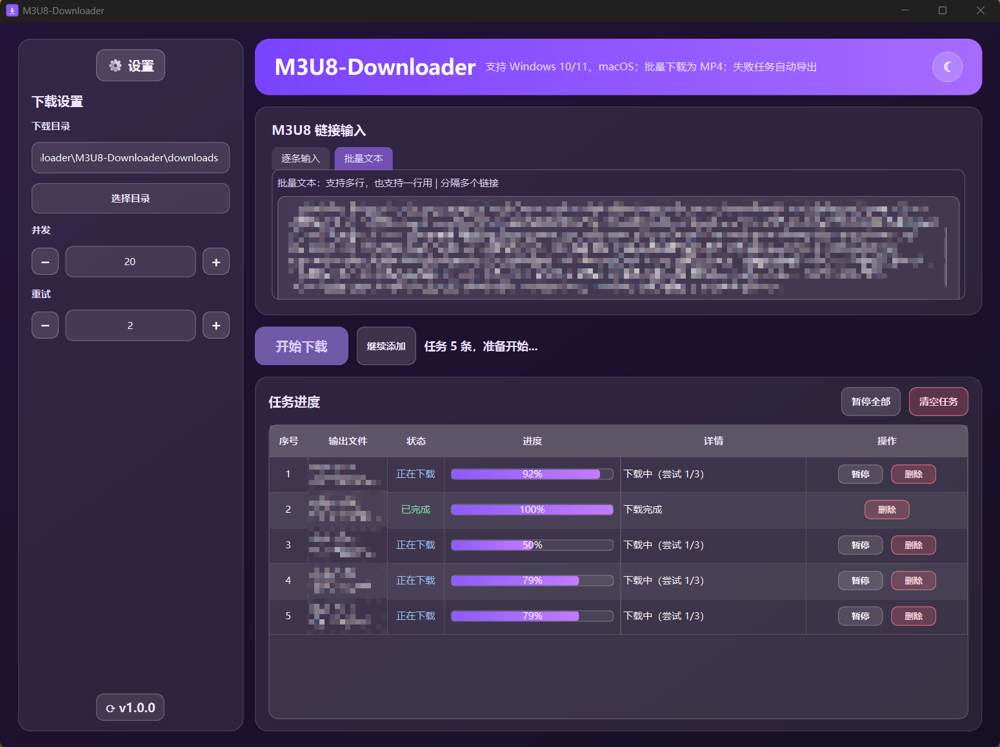

# M3U8-Downloader

[中文](README.zh-CN.md) | [English](README.en.md) | [日本語](README.ja.md)

## 快速说明

- 跨平台桌面客户端：Windows 10/11、macOS
- 批量下载 `m3u8` 并输出 `mp4`
- 支持任务进度、暂停/继续、失败任务导出
- 支持主题切换与中/英/日界面语言切换（默认中文）

## 文档

- 中文文档: [README.zh-CN.md](README.zh-CN.md)
- English docs: [README.en.md](README.en.md)
- 日本語ドキュメント: [README.ja.md](README.ja.md)

## 下载

- 最新版本（跳转到最新 tag 发布页）: [Releases Latest](https://github.com/lengziyu/m3u8-downloader/releases/latest)
